## Edge detection - Class 1

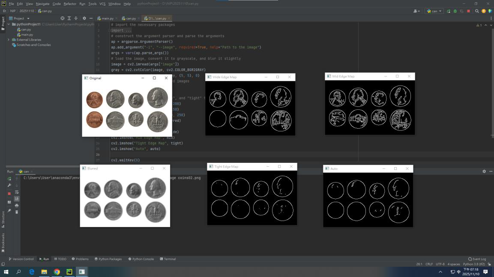

## Finding and drawing contours - Class 2 

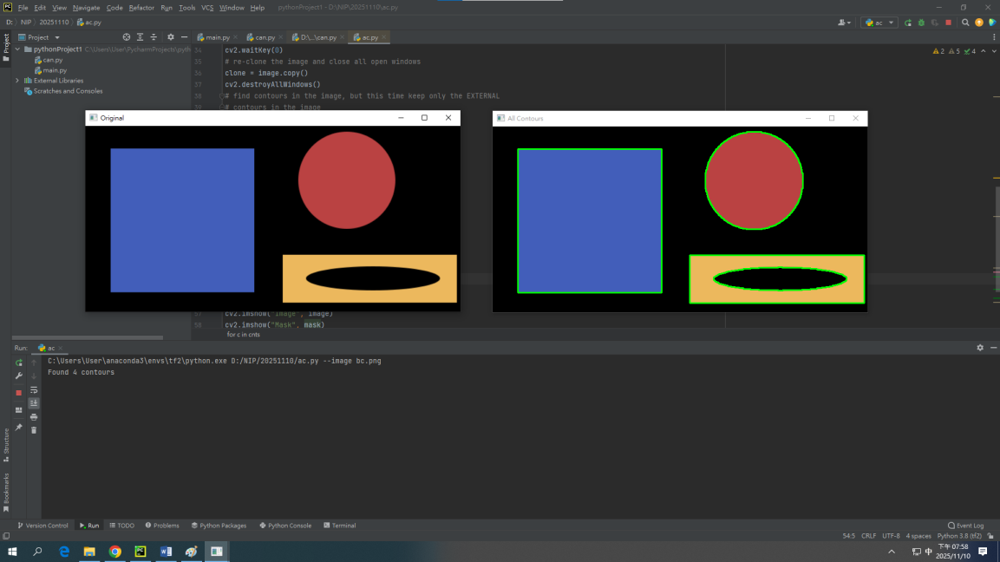

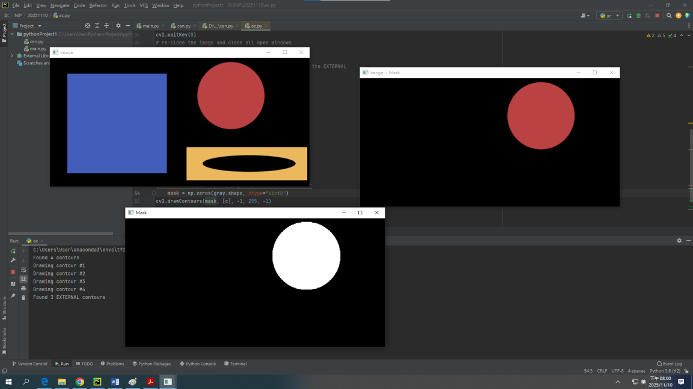

### Bonus

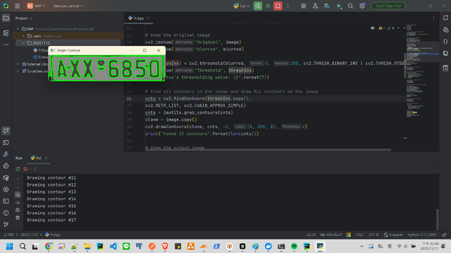

#### Eroded

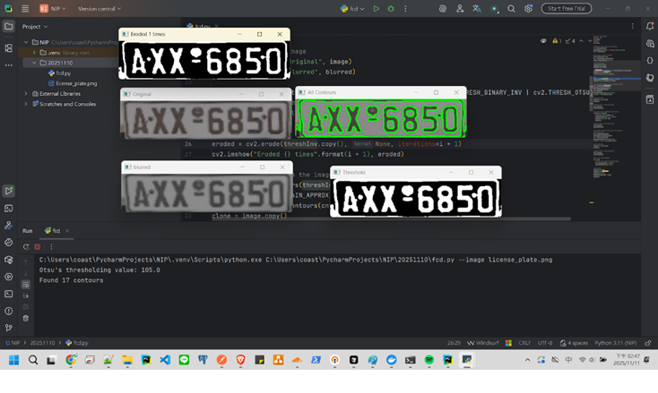

#### Blurred

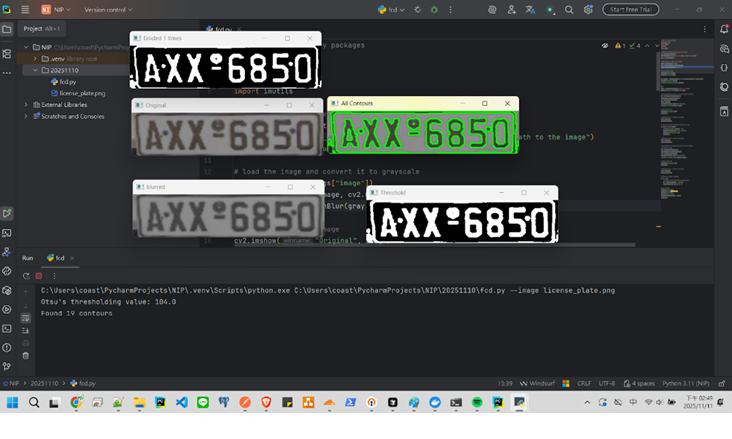

#### Dilated

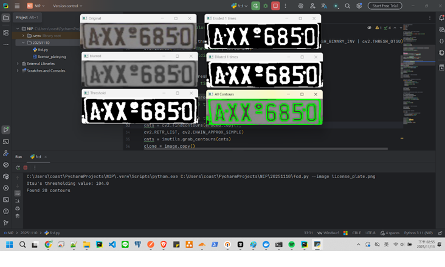

## Simple contour properties - Class 3 

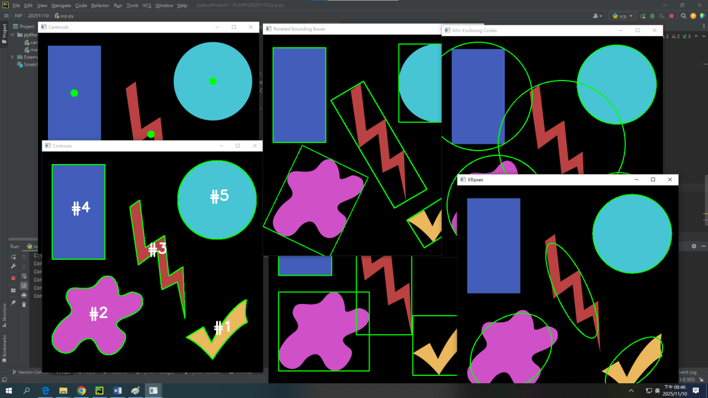

### Bonus

#### Retangle

#### Mask

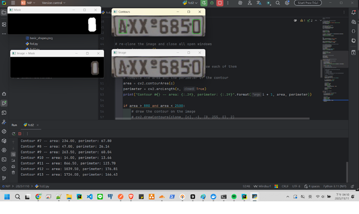

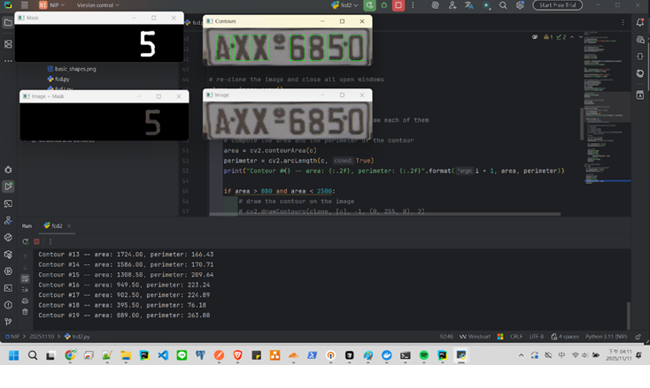

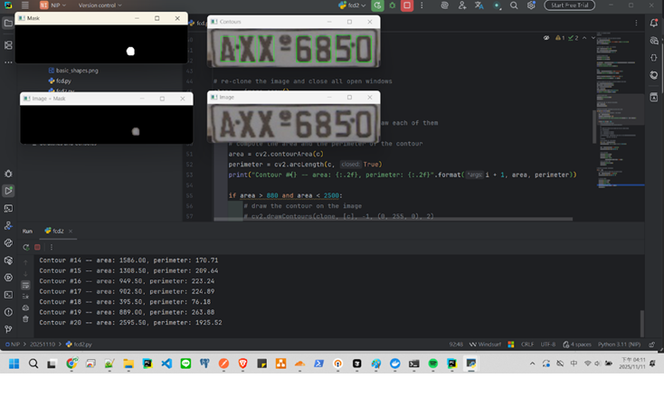

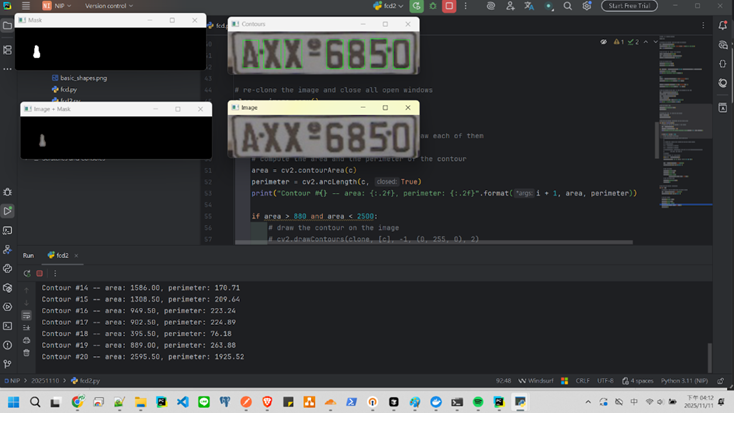

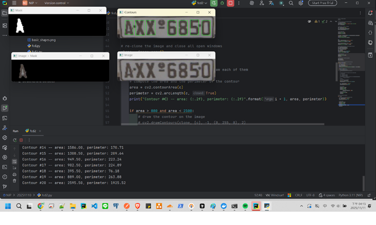

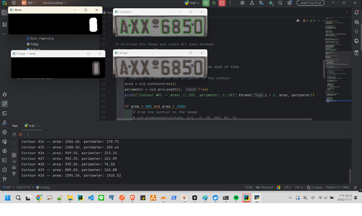

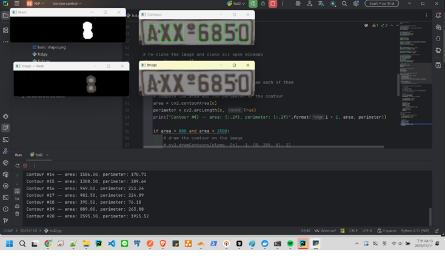

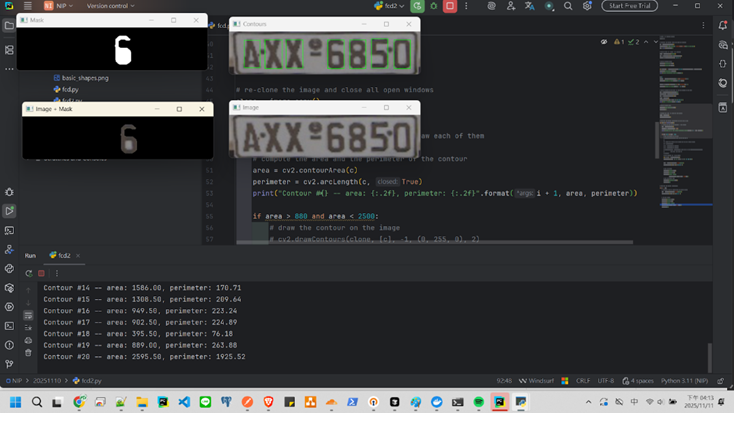

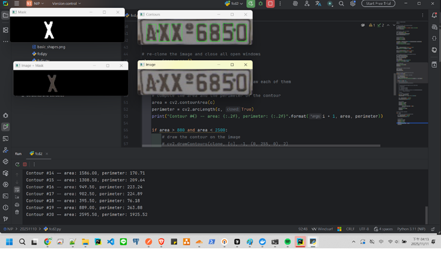

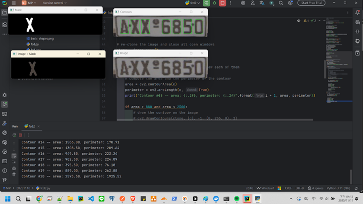

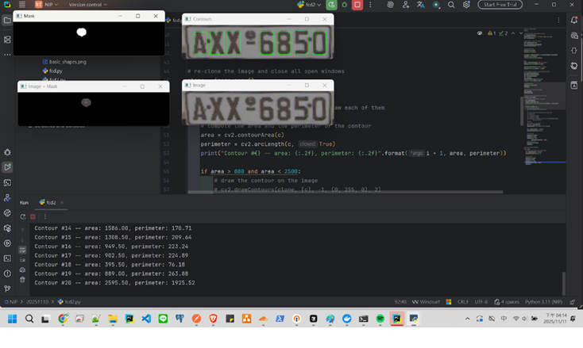

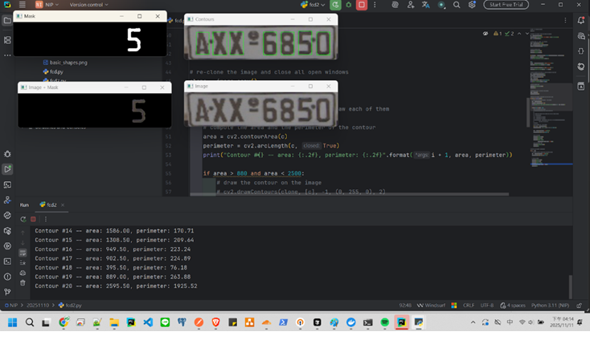

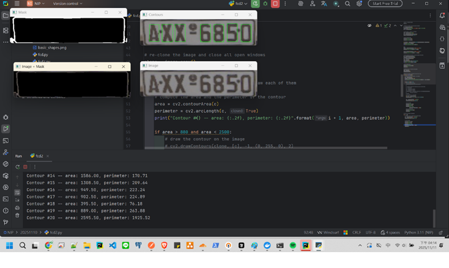